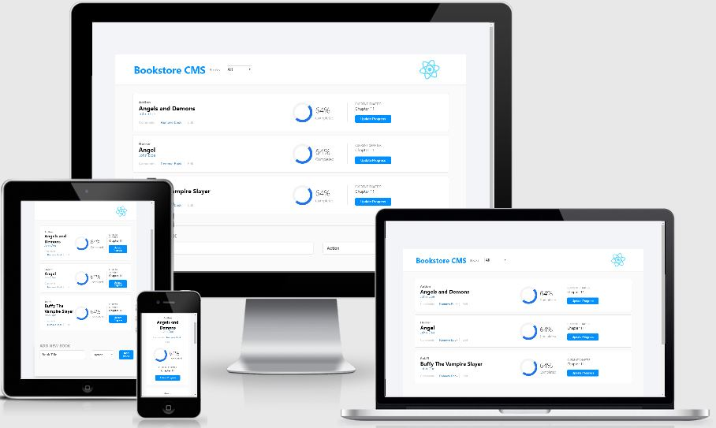

# BookStore React-Redux Project

> This project I only lay foundations for my Bookstore website. I create a React and Redux app. I structure my files using the "feature folder" approach. I also set up routing using React Router.

## Built With 🔨

- Create React App
- JXS
- CSS
- Visual Studio Code
- Git & Github
- React
- Redux
- React-Redux
## Deployment Live Demo

<!-- - [Live Demo On Heroku](https://dansam-math-magician.herokuapp.com/)
- [Live Demo On Netlify](https://objective-hopper-31e2ea.netlify.app/) -->
### Prerequisites

- IDE to edit and run the code (We use Visual Studio Code 🔥).
- [Node.js](https://nodejs.org/en/download/) already downloaded.

To get a local copy up and running follow these simple example steps.

### Install

To get a local copy up and running follow these simple example steps.
- Open terminal
- Clone this project using the command `git clone https://github.com/DanSam5K/Bookstore-React-Redux-App.git`
- `cd <clone>` folder
- Run `npm install` to install all project dependencies
- Run `npm start` in your local browser or using Live Server in Visual Studio Code.

## Author

👤 **Daniel Samuel**

- Github: [DanSam5k](https://github.com/DanSam5k)
- Twitter: [@_dan_sam](https://twitter.com/_dan_sam)
- Linkedin: [dansamuel](https://www.linkedin.com/in/dansamuel/)
### Usage

- For anyone who wants to practice Webpack skills.
- How to manage your front-end files using Webpack.

## 🤝 Contributing

Contributions, issues, and feature requests are welcome!

Feel free to check the [issues page](https://github.com/DanSam5K/Bookstore-React-Redux-App/issues).

## Show your support

Give a ⭐️ if you like this project!

## Acknowledgments

- Hat tip to anyone whose code was used 🔰
- Inspiration 💘
- Microverse program ⚡
- Our standup team 🏹
- Our family's support 🙌

## 📝 License

This project is [MIT](./LICENSE) licensed.